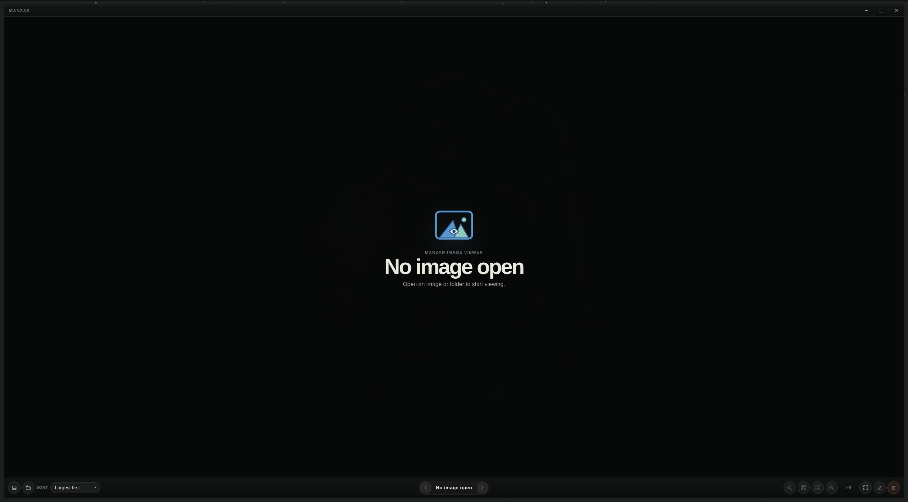

<h1 align="center">
  
  <br>
  Manzar
</h1>

<p align="center">
  A simple local image viewer for opening and navigating image files without turning them into a photo library.
</p>

<p align="center">
  <strong>PNG</strong> · <strong>JPEG</strong> · <strong>WebP</strong> · <strong>GIF</strong> · <strong>BMP</strong>
</p>

<p align="center">
  <a href="#screenshots">Screenshots</a>
  ·
  <a href="#features">Features</a>
  ·
  <a href="#installation">Installation</a>
  ·
  <a href="#development">Development</a>
</p>

---

## Screenshots

<p align="center">
  
  
</p>

## Features

- Open a single image, selected images, or a folder.
- Navigate through image sequences with previous/next controls.
- Sort by newest modified, name, largest first, or smallest first.
- Fit to window, zoom, view actual size, pan, and enter fullscreen.
- Warn before displaying very large images that may be slow.
- Rename or move only the current image to trash.

## Installation

Download the latest desktop installer for your operating system from the GitHub Releases page.

- **Linux:** use the AppImage for the easiest install.
- **Arch Linux:** install from source with the repo-root `PKGBUILD`, or install the prebuilt `.pkg.tar.zst` release asset with `pacman -U` when available.
- **Windows:** use the Windows installer asset.
- **macOS:** use the macOS disk image or app bundle asset for your Mac.

Manzar is a desktop application. Mobile builds are not published.

### Arch Linux package install

Install Manzar from the tagged release source using the repo-root `PKGBUILD`:

```sh
git clone https://github.com/Abdirrahman/Manzar.git
cd Manzar
makepkg -si
```

A convenience wrapper is also available. It installs the bootstrap tools with Pacman, runs `makepkg -si` as your user, and never copies files directly into `/usr`:

```sh
./scripts/install-arch.sh
```

To install a prebuilt Arch package downloaded from GitHub Releases:

```sh
sudo pacman -U ./manzar-0.1.0-1-x86_64.pkg.tar.zst
```

Verify the checksum first when the matching `.sha256` asset is available:

```sh
sha256sum -c ./manzar-0.1.0-1-x86_64.pkg.tar.zst.sha256
```

There is no hosted Pacman repository yet, so `pacman -S manzar` is not supported.

Uninstall the Pacman package with:

```sh
sudo pacman -Rns manzar
```

### Build from source for development

Install the build and runtime dependencies. On Arch Linux:

```sh
sudo pacman -S --needed base-devel rust bun webkit2gtk-4.1 curl wget file openssl appmenu-gtk-module libappindicator librsvg xdotool
```

Clone this repository, then run Manzar in development mode:

```sh
bun install
bun run tauri dev
```

Build local desktop bundles:

```sh
bun install
bun run tauri build
```

Build artifacts are written under `src-tauri/target/release/bundle/`.

### Maintainer release flow

Desktop release builds are created by GitHub Actions when a version tag is pushed:

```sh
git tag v0.1.0
git push origin v0.1.0
```

The workflow builds Linux, Windows, macOS desktop installers, and an x86_64 Arch package, then creates a draft GitHub Release.

## Shortcuts

| Action | Shortcut |
| --- | --- |
| Open images | `O` |
| Open folder | `Shift+O` |
| Previous / next | `←` / `→` |
| Zoom out / in | `-` / `+` |
| Actual size | `0` |
| Fit to window | `F` |
| Fullscreen | `F11` |
| Rename current image | `R` |
| Move current image to trash | `Delete` |
| Close dialog/fullscreen/error | `Esc` |

## Development

```sh
bun install
bun run build
cargo test --manifest-path src-tauri/Cargo.toml
```

## Stack

Tauri 2, React 19, TypeScript, and Vite.
