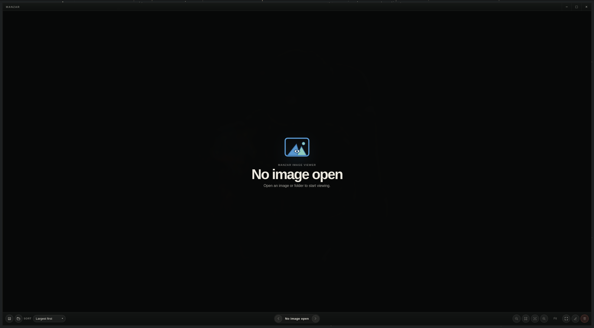

<h1 align="center">
  
  <br>
  Manzar
</h1>

<p align="center">
  <strong>A simple local image and video viewer for people who don't want a photo library.</strong>
</p>

<p align="center">
  PNG · JPEG · WebP · GIF · BMP · MP4 · MOV · MKV · WebM
</p>

---

Manzar opens local image and video files, selections, and folders without importing them into a catalogue, syncing them to an account, or trying to manage your media for you.

Use it when you want to quickly inspect a directory of images, move through a sequence, zoom in, rename one file, or send the current image to trash — then get out of the way.

<p align="center">
  
  
</p>

## Features

- Open a single file, multiple selected files, or a folder.
- Play MP4, MOV, MKV, and WebM with native controls; space toggles playback.
- Navigate mixed image and video sequences with previous/next controls.
- Sort by name, newest modified, largest first, or smallest first.
- Fit to window, zoom, view actual size, pan, and fullscreen.
- Warn before displaying very large images that may be slow.
- Crop still PNG, JPEG, WebP, and BMP images with draggable corners, aspect ratios, pixel inputs, and keyboard adjustments. Save crop replaces the original file in place.
- Rename the current image without leaving the viewer.
- Move only the current image to trash.
- Open image and video files from the desktop/file manager on Linux via `manzar %F`.

> On Linux, video playback needs the GStreamer plugins (`gst-plugins-base`,
> `gst-plugins-good`, `gst-plugins-bad-libs`, `gst-libav`). The Arch package depends
> on them; other distributions may need them installed separately.

## Cropping

Open a still image, choose **Crop** (or press `C`), and drag the corners or enter exact pixel coordinates. Use an aspect ratio preset for a square, 4:3, 16:9, or original-ratio crop. Focus the selection or a corner and use arrow keys for precise adjustments; hold Shift for ten pixels at a time.

**Save crop** replaces the original at the same path and refreshes the viewer. Cancel or Escape leaves it unchanged. Saving preserves the format, transparency and embedded colour profile, and applies the image's orientation before cropping. JPEG crops are re-encoded at quality 95; other camera metadata is not retained. A temporary file is encoded and synced before atomically replacing the source, so a failed encode or write leaves the source intact. GIF, animated PNG/WebP and videos remain viewable but cannot be cropped.

## Install

Download the latest desktop build from [GitHub Releases](https://github.com/Abdirrahman/Manzar/releases).

| Platform | Recommended install |
| --- | --- |
| Linux | AppImage from GitHub Releases |
| Arch Linux | `makepkg -si` from this repo, or a `.pkg.tar.zst` release asset with `pacman -U` |
| Windows | Windows installer asset from GitHub Releases |
| macOS | DMG or app bundle asset from GitHub Releases |

Manzar is a desktop application. Mobile builds are not published.

## Arch Linux

Manzar supports two Pacman-based Arch install flows.

### Build and install with `makepkg`

```sh
git clone https://github.com/Abdirrahman/Manzar.git
cd Manzar
makepkg -si
```

This builds an Arch package from the `packaging/arch/PKGBUILD` and installs it through Pacman.

### Use the convenience script

```sh
git clone https://github.com/Abdirrahman/Manzar.git
cd Manzar
./scripts/install-arch.sh
```

The script installs the bootstrap tools with Pacman, then runs `makepkg -si` as your user. It does not manually copy files into `/usr`.

### Install a prebuilt package

When a release includes Arch package assets, download both files:

```text
manzar-0.1.1-1-x86_64.pkg.tar.zst
manzar-0.1.1-1-x86_64.pkg.tar.zst.sha256
```

Then verify and install:

```sh
sha256sum -c ./manzar-0.1.1-1-x86_64.pkg.tar.zst.sha256
sudo pacman -U ./manzar-0.1.1-1-x86_64.pkg.tar.zst
```

To uninstall:

```sh
sudo pacman -Rns manzar
```

> [!NOTE]
> `pacman -S manzar` is not supported yet. That command requires Manzar to be published in a Pacman repository, which is not available today.

## Shortcuts

| Action | Shortcut |
| --- | --- |
| Open images | `O` |
| Open folder | `Shift+O` |
| Previous / next | `←` / `→` |
| Zoom out / in | `-` / `+` |
| Actual size | `0` |
| Fit to window | `F` |
| Fullscreen | `F11` |
| Crop current image | `C` |
| Save crop | `Ctrl+Enter` / `⌘+Enter` |
| Move crop / resize focused corner | Arrow keys (`Shift` for 10 pixels) |
| Keyboard shortcuts | `?` |
| Rename current image | `R` |
| Move current image to trash | `Delete` |
| Close dialog/fullscreen/error | `Esc` |

## Development

Prerequisites:

- [Bun](https://bun.sh/)
- [Rust](https://www.rust-lang.org/tools/install)
- Tauri Linux system dependencies for your distribution

On Arch Linux, install the development dependencies with:

```sh
sudo pacman -S --needed base-devel rust bun webkit2gtk-4.1 curl wget file openssl appmenu-gtk-module libappindicator librsvg xdotool
```

Run the app in development mode:

```sh
bun install
bun run tauri dev
```

Build frontend and backend checks:

```sh
bun run build
bun test tests
cargo test --manifest-path src-tauri/Cargo.toml
```

Build local desktop bundles:

```sh
bun run tauri build
```

Build artifacts are written under `src-tauri/target/release/bundle/`.

## Release

Desktop release builds are created by GitHub Actions when a version tag is pushed:

```sh
git tag v0.1.1
git push origin v0.1.1
```

The release workflow builds Linux, Windows, macOS desktop installers, and an x86_64 Arch package, then creates a draft GitHub Release.

## Stack

- Tauri 2
- React 19
- TypeScript
- Vite
- Bun
- Rust

## License

[MIT](LICENSE)
