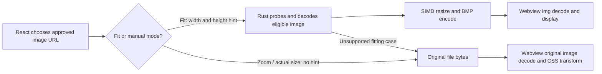

# Image rendering review and Rust implementation plan

Reviewed 5 October 2026 at commit `da19ceef6e47de3af6d3eee39b7e502fb860158c`. This is the historical review; the later [Rust rewrite results](rust-rewrite-results.md) document the implemented changes and measured gains.

## Recommendation

There is no dedicated JavaScript image rendering or image processing library to rewrite. React creates the viewer's DOM; the system webview renders native `` elements and CSS transforms. The expensive fit-to-window processing has already moved into Rust.

The next useful work is to measure the running viewer, reuse its existing Rust output, and prototype Rust rendering of the visible region for large images. A complete native GPU renderer is a later option if measurements justify the integration work. Significant *additional* gains over the current application have not yet been demonstrated.

The follow-up [Rust performance review](rust-performance-review.md) examines internal rewrites, dependency behavior, and fresh CPU-stage measurements. It identifies a correction to the rendering comments: the pinned JPEG decoder's metadata constructor reads the whole compressed file, despite the “header only” description.

## What is used today

Versions below come from the repository lockfiles, rather than the dependency ranges.

| Library or component | Role and code evidence | Rust assessment |
| --- | --- | --- |
| React / React DOM 19.2.7 | UI state, controls, and DOM. Dependencies in `package.json`; viewer in `src/App.tsx:513`. | Rewriting React would require a UI migration with no demonstrated image-performance benefit. |
| Tauri API and Tauri 2.11.4 / Wry 0.55.1 | Connect the frontend to the Rust backend and host the system webview. Custom image protocol in `src-tauri/src/lib.rs:80`. | The native bridge is already Rust. Keep it. |
| Native `` and the system webview | Decode and display original files or fitted BMP responses. `src/App.tsx:101` selects the URL; `src/App.tsx:523` requests asynchronous image decoding. | A viewport renderer could reduce the image data the webview holds, but replacing the engine itself is unnecessary. |
| `useImagePresentation` and CSS | JavaScript computes scale and pan; CSS performs the transform. `src/useImagePresentation.ts:40`, `src/useImagePresentation.ts:66`, `src/App.css:260`. | Candidate for moving pixel rendering to Rust. The JavaScript arithmetic itself is trivial. |
| `CropEditor` | React selection overlay and coordinate arithmetic, with a fitted `` preview. `src/CropEditor.tsx`, `src/App.tsx:433`. | Keep the overlay in React. Actual decode, crop, encode, and atomic save are already Rust in `src-tauri/src/core/crop.rs:86`. |
| `image` 0.25.10 | Format probing, orientation, decoding, encoding, and crop operations. | Already Rust; reuse it. |
| `fast_image_resize` 6.1.0 | SIMD Lanczos3 resizing in `src-tauri/src/core/render.rs:211`. | Already Rust; extend it to visible-region resampling rather than rewriting it. |
| `jpeg-decoder` 0.3.2 | Reduced-resolution JPEG decode in `src-tauri/src/core/render.rs:173`. | Already Rust; retain scaled decoding where beneficial. |
| `zune-jpeg` 0.5.15 | Transitive JPEG decoder used by `image`. | Calling it directly is not a new decoder optimization. |

Tauri uses WebKitGTK on Linux, WKWebView on macOS, and WebView2 on Windows. Actual image and compositing behavior therefore depends on the target engine. [Tauri webview documentation](https://tauri.app/reference/webview-versions/)

There are no frontend dependencies such as Sharp, Jimp, Canvas rendering frameworks, or third-party zoom/crop libraries in `package.json`. The standalone `benches/render-bench` crate is a measurement rig, not a shipping frontend dependency.

## Current data flow

`serve_media_path` calls `fit_image` only when a viewport hint is present (`image_protocol.rs:128`). Eligible oversized still images are oriented, resized, and encoded as BMP. Small images, GIFs, animated PNG/WebP, images with alpha, and profiles rejected by the current profile check retain the original-file path (`render.rs:75`, `render.rs:125`, `crop.rs:47`). Opaque PNG/WebP/BMP may still require a full source decode in Rust; JPEG can use reduced DCT resolution.

Manual zoom changes the URL to the original file (`App.tsx:101`). This restores source detail but also gives up the fitted surface's smaller webview decode. Subsequent transforms do not necessarily fetch or decode the source again.

The protocol already runs expensive work on a blocking worker, releases the registry lock before decoding, serializes requests to limit memory, and skips superseded queued requests (`lib.rs:169`). It does not interrupt an already-running decode. Metadata caching exists (`viewed_image_descriptor.rs:24`), but fitted image bytes and decoded frames are not cached by the Rust render path. Browser caching may already avoid some duplicate requests; measure it before attributing every revisit to another decode.

## What the existing benchmarks establish

`src-tauri/fit-bench-report.json` contains these historical results at a 2560 × 1440 viewport:

| Fixture | Original-path CPU model | Fitted-path CPU model | Ratio |
| --- | ---: | ---: | ---: |
| 12 MP JPEG | 169.4 ms | 51.0 ms | 3.33× |
| 24 MP JPEG | 289.0 ms | 93.6 ms | 3.09× |
| Approximately 60 MP JPEG (`61mp`) | 624.9 ms | 156.3 ms | 4.00× |
| 12 MP PNG | 202.4 ms | 81.2 ms | 2.49× |

These figures describe the optimization **already implemented**. They are not forecasts of additional gains, and were not rerun for this review.

The harness calls the real Rust protocol handler, then simulates the webview with `image::load_from_memory` and a CPU Lanczos resize (`src-tauri/examples/fit_bench.rs:69`). The candidate also decodes its BMP using Rust. This measures a CPU pipeline, not actual time to display in WebKitGTK. A browser's GPU sampling and caching can differ substantially; the assertion in older reports that the model is necessarily a conservative lower bound is not established by these measurements.

Likewise, `zoom_full_reraster` allocates and resizes an entire image at the requested magnification (`benches/render-bench/src/paths.rs:230`). It does not execute the frontend's CSS transform. The older HTML report's very large zoom speedups cannot be treated as measured app gains. WebKit supports accelerated compositing; whether a particular image is repainted, tiled, or composited needs a runtime trace. [WebKit compositing documentation](https://trac.webkit.org/wiki/Accelerated%20rendering%20and%20compositing)

The dimension calculation is useful: the approximately 60 MP image represents 240,869,376 bytes of RGBA at source resolution, versus 12,441,600 bytes at the fitted dimensions. That is approximately 19.4× fewer display pixels. It is neither a measurement of process RSS nor proof of an equal reduction in total application memory: Rust decode buffers, transport, and engine/GPU copies also count.

## Ranked opportunities

| Priority | Component and change | Potential benefit | Confidence and cost |
| --- | --- | --- | --- |
| 1 | Cache fitted responses in Rust; size them for the actual viewer stage. | Avoid repeat decode/resize/encode work on backend cache hits; generate fewer unnecessary pixels. | Direct reduction in work, low to moderate implementation cost. User-visible gain depends on current request/cache behavior. |
| 2 | Move large still-image zoom/pan pixel generation to a Rust visible-region renderer with a bounded decoded-frame cache. | Limit webview display surfaces to viewport size and reuse decoded pixels during interaction. | Strong memory rationale, uncertain latency gain against browser GPU transforms; moderate cost. |
| 3 | Extend fitting to transparent still images using RGBA. | Bring large alpha PNG/WebP images onto the fitted path. | Conditional on the user's image corpus; moderate cost, especially output transport and color fidelity. |
| 4 | Prototype a Rust `wgpu` image surface with persistent textures. | Avoid encoding and transferring a new image for every rendered viewport; make pan/zoom texture-coordinate updates. | High integration cost; a prototype must prove both presentation integration and performance. |

Keep React controls and the crop overlay. If profiling shows pointer updates are expensive, coalesce them with `requestAnimationFrame` and update only the image transform/overlay. `updatePan` currently calls React state on every pointer move, causing `App` to render. This is a small frontend optimization to try before adding a per-frame Rust round trip.

## Implementation plan

### Step 1 — Measure the current release app

Instrument request queue wait, file read, probe, decode, orientation, resize, encode, response size, and cache outcome in the Rust path. Correlate them with frontend request start, image load/decode readiness, and frame timing. `onLoad` and animation-frame callbacks are useful proxies, not proof of physical screen presentation; use engine traces or captured display frames for presentation claims. WebKitGTK exposes a Web Inspector. [WebKitGTK inspector API](https://webkitgtk.org/reference/webkit2gtk/stable/method.WebView.get_inspector.html)

Compare current fitted mode, original-file mode, and subsequent candidates in the same engine and release build. Include cold opens, warm revisits, fit-to-zoom transitions, sustained pan, resize/fullscreen, and rapid navigation. Record p50/p95 latency, missed frames, request counts, and combined core/webview process memory; include GPU memory where tooling permits.

Use representative 12/24/60 MP photos plus opaque and transparent PNG/WebP, progressive JPEG, EXIF orientations, grayscale/CMYK, embedded profiles, animation, corrupt files, and small images. Test the default-size window and high-DPI/fullscreen views. Start on Linux, then validate macOS and Windows before changing their defaults.

Update the benchmark descriptions so the existing results are clearly labeled CPU models and the current fitted path is the baseline for new work. Keep microbenchmarks for isolating algorithms, separate from actual app results.

### Step 2 — Reuse fitted output and measure the viewer stage

Changes: `src/App.tsx`, `src-tauri/src/lib.rs`, `core/image_protocol.rs`, `core/render.rs`, a small `core/render_cache.rs`, and mutation/session invalidation hooks.

1. Observe the actual viewer content area rather than `window.innerWidth/innerHeight`. Account for padding, device pixel ratio, and the smaller crop preview area. Retain debounce/quantization to avoid excessive render requests.
2. Start with a byte-bounded cache of fitted encoded responses, for example 64 MiB. Key by approved image identity, source fingerprint (canonical path, length, modification time), target dimensions, and output settings. Revalidate approval before serving a hit. Keep the last useful viewport variants instead of building a general cache framework.
3. Invalidate on crop, rename, trash, session reset, registry revocation, and external source changes. Source approval IDs alone are insufficient: external changes can retain the same ID. Use before/after metadata checks when producing an entry. The existing size/mtime fingerprint is a practical starting point with known limits for same-size, preserved-timestamp edits.
4. Keep decode work outside registry/session locks and retain the existing memory gate. Bound response copies and in-flight allocations as well as retained cache bytes. A cache hit skips backend processing but still has transport and webview work.

Verify cache hits skip the decoder, viewport variants are distinct, invalidated IDs never serve cached content, memory stays bounded, and resize/crop previews remain sharp. Compare actual warm navigation and resize latency against Step 1.

### Step 3 — Prototype visible-region zoom for large still images

Changes: extend `core/render.rs` and `core/render_cache.rs`, add a typed render request at the protocol boundary, and update `useImagePresentation.ts` / `App.tsx` to display returned viewport frames.

1. Define an internal request with approved image ID, source generation, output device-pixel dimensions, a source-space visible rectangle, and request generation. Validate finite coordinates, positive sizes, source bounds, output pixel budget, and supported media before allocating.
2. Keep user interaction in React. Convert the centered CSS scale/pan geometry into oriented source coordinates and output placement. Include letterboxing and regions outside the image; clamp the sampled source and fill the uncovered background. Explicitly map CSS pixels to device pixels.
3. Decode a suitable resolution once and retain it under a byte budget. Upgrade resolution lazily as zoom needs more detail; never treat an upscaled fit preview as actual-size detail. A full-resolution source may still be required for 1:1. Reuse `fast_image_resize::ResizeOptions::crop`, which already supports source-region resampling. [ResizeOptions documentation](https://docs.rs/fast_image_resize/6.1.0/fast_image_resize/struct.ResizeOptions.html)
4. Coalesce interaction requests and keep only the latest pending viewport per active image. Maintain separate foreground/prefetch priorities if prefetch is later added. Do not queue one image encode for every pointer event. Reject stale completions in the frontend and keep the last valid frame visible until its replacement is decoded.
5. Initially use the existing BMP transport for opaque frames. Measure the complete path, including copies, BMP decode, and presentation. A 2560 × 1440 RGB frame is about 11.1 MB; at 60 frames/s its payload alone is about 664 MB/s. The current browser compositor may outperform this path.
6. Preserve the original-file route for unsupported media and failures. If a source/frame exceeds the cache budget, fall back rather than silently removing memory limits. Add next/previous predecode only after traces show navigation is decode-bound, with one low-priority job, spare memory, and no preloading of unapproved oversized images.

This bounds the output and webview surface, **not** total source memory or first decode cost. PNG and the current JPEG APIs are not general region-only decoders; full source pixels may still live in Rust. Downsampling cost can also depend on the size of the sampled source rectangle. Do not promise constant total work or low total memory solely because the output is viewport-sized.

Verify inverse coordinate mapping, all EXIF orientations, 1:1 detail, DPR changes, pan edges, stale requests, navigation, crop invalidation, and fallback. Adopt only for workloads where the real app beats its existing CSS path.

### Step 4 — Extend eligible fitting to RGBA if the corpus warrants it

Add an alpha-preserving pixel path using `fast_image_resize` U8x4 with alpha handling. Benchmark an alpha-capable encoded response and verify its transparency in each actual webview; the current RGB BMP path is not a drop-in solution. Compare PNG encoding cost against sending the original file before choosing a format.

Keep animation delegated to the webview. Specify and test color behavior before expanding eligibility: the current ICC check is merely a search for the bytes `sRGB` (`render.rs:147`), not profile validation or conversion. The resizer does not automatically linearize sRGB. Validate transparent edges, profiles, gamma metadata, and higher-bit-depth files; conservatively retain fallback where fidelity is not established. [Resizer color-space documentation](https://docs.rs/fast_image_resize/6.1.0/fast_image_resize/#colorspace)

### Step 5 — Native GPU presentation only if Step 3 exposes a transport bottleneck

Time-box a `wgpu` surface integration spike. Keep the React shell, upload source textures once, and render the visible region using texture coordinates. A `wgpu::Surface` presents to a platform surface; it is not an automatic texture attachment to a DOM ``. Embedding alongside Tauri requires a working platform presentation design. [wgpu surface documentation](https://docs.rs/wgpu/latest/wgpu/struct.Surface.html)

Prove Linux Wayland/X11 placement, overlay ordering, crop controls, input, resizing, fullscreen, high DPI, and device loss; then macOS and Windows integration. Large sources may exceed texture limits and require tiling. GPU rendering removes repeated frame transport only if presentation remains on the native/GPU side; reading pixels back into BMPs reintroduces that cost. Keep the existing renderer if the spike cannot meet these requirements economically.

## Decision gates and delivery order

Deliver separately: measurement/report corrections → fitted response cache and stage sizing → visible-region prototype → optional RGBA fitting → optional GPU spike. No new image codec or rendering dependency is needed for the first three steps.

Treat “significant” as a proposed acceptance threshold: at least 25% lower p95 latency in the targeted real-app workload, or at least 50% lower measured combined memory for large-image viewing, without a material latency/quality regression elsewhere. For interaction, aim for a 16.7 ms frame budget on the reference 60 Hz device. These are implementation gates, not predicted outcomes. Retain a candidate only after same-machine, same-quality comparisons and fallback checks pass.

Do not replace `image` with direct `zune-jpeg` calls for expected speedups, rewrite the tiny crop/zoom arithmetic in Rust/WASM, or rebuild React. Reduced JPEG decoding is already implemented; its 1/8, 1/4, and 1/2 scale support is documented by the current decoder. [jpeg-decoder scale API](https://docs.rs/jpeg-decoder/0.3.2/jpeg_decoder/struct.Decoder.html#method.scale)

## Validation performed for this review

- Traced frontend dependencies, fit/manual/crop URL selection, CSS presentation, protocol scheduling, decoder eligibility, metadata caching, registry invalidation, and benchmark implementations.
- Existing Rust library suite: 90 tests passed in the sandbox; nine media-server tests were initially prevented from binding loopback sockets. Those nine passed when rerun with local socket access. All 99 library tests therefore passed across the two runs.
- Existing frontend test: one crop-geometry test passed, including 2,491 assertions.
- During this initial frontend review, no new runtime benchmark, engine trace, or cross-platform presentation test was performed. Application source and dependencies were not changed. The follow-up Rust review adds isolated CPU-stage benchmarks, documented separately above.
